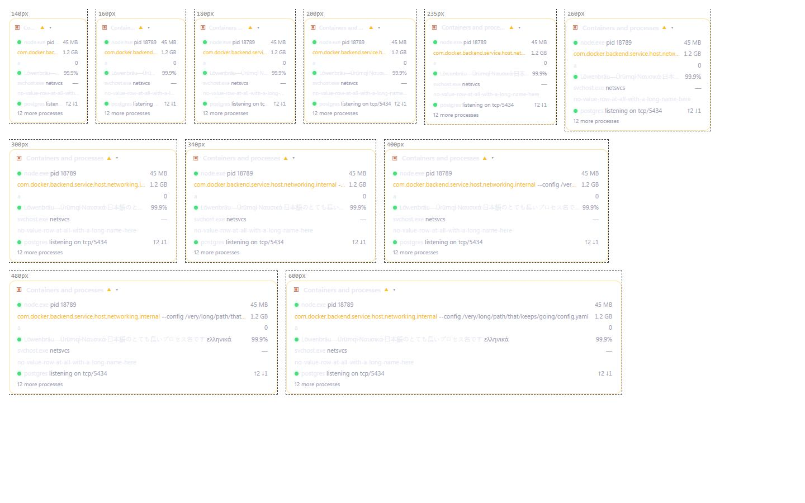
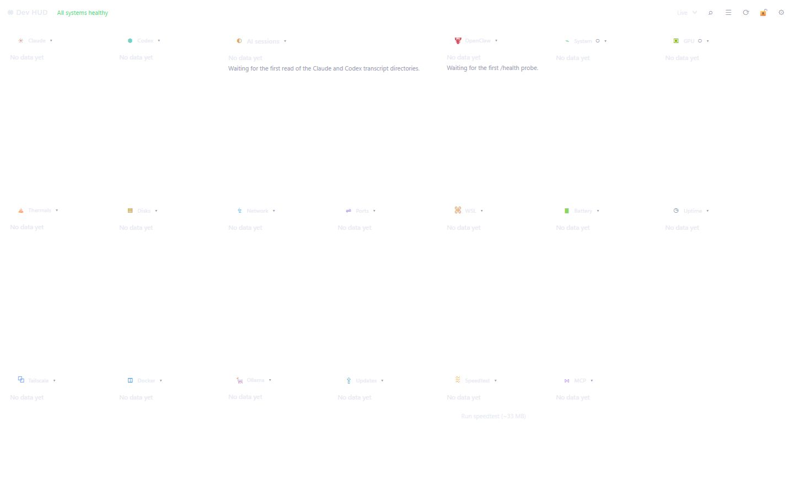
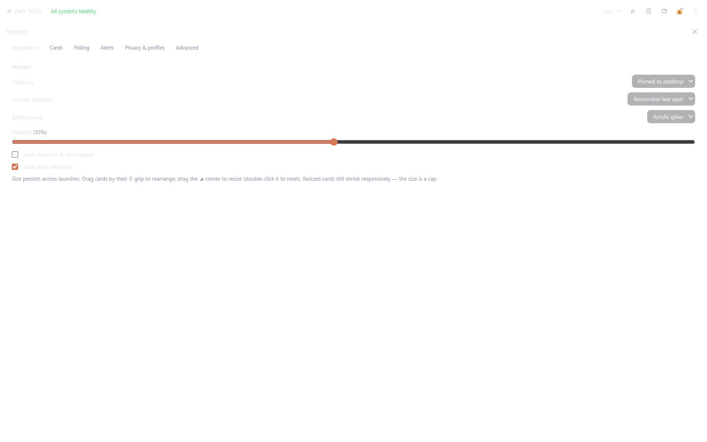
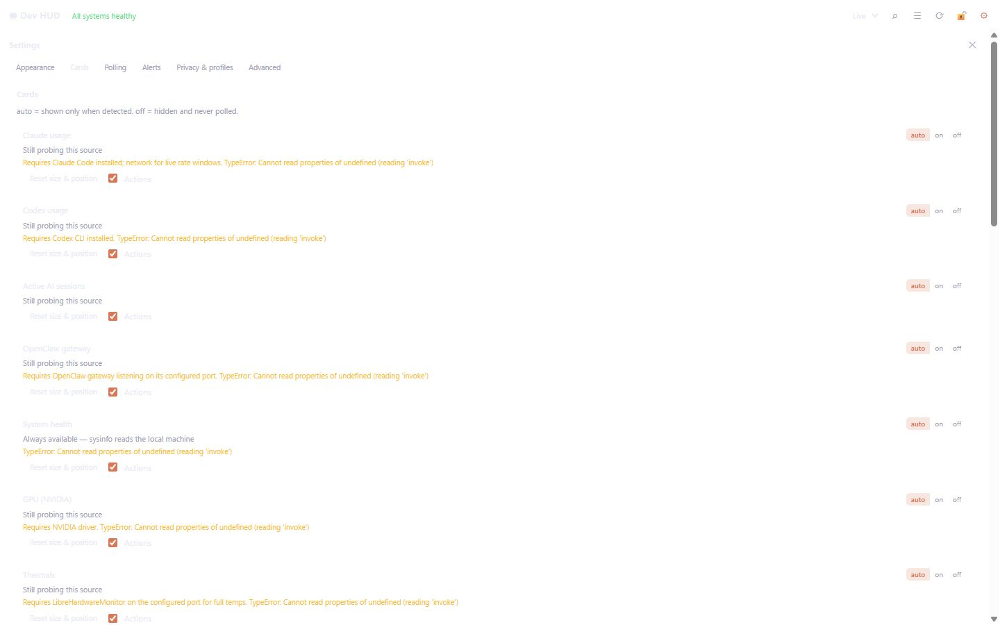
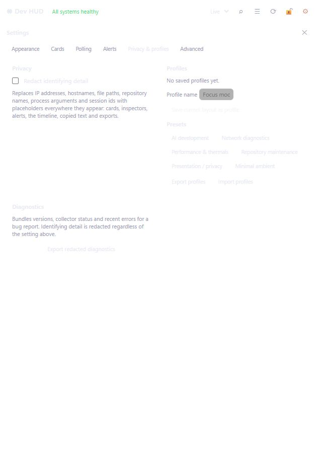
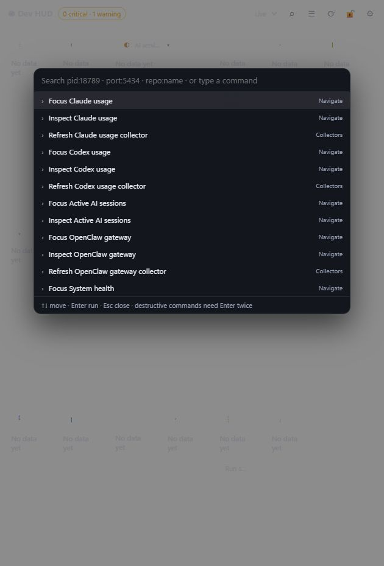
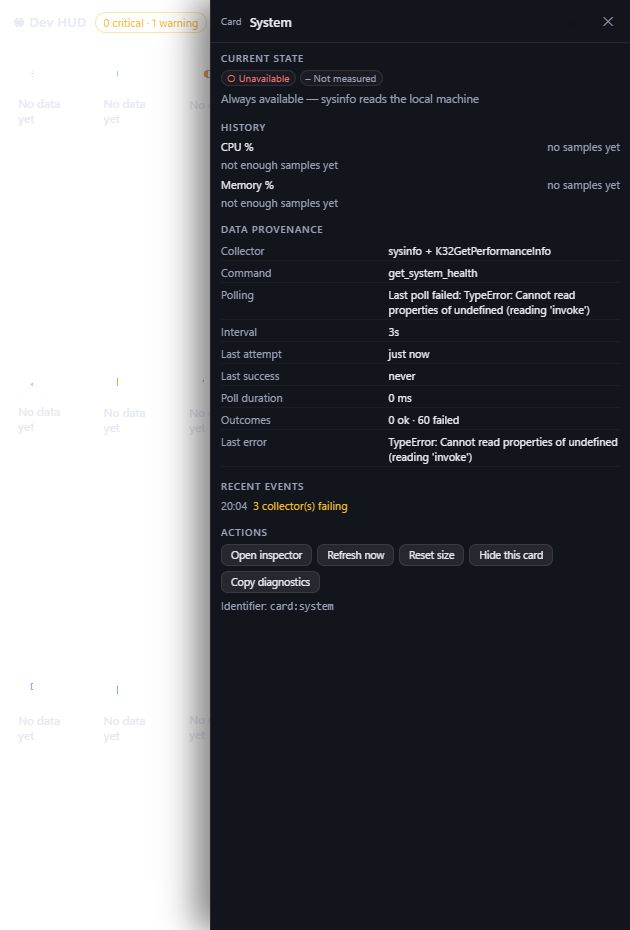
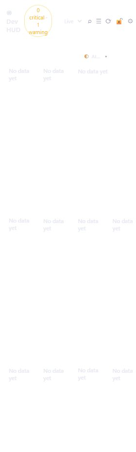

# Dev HUD: Product Audit and Reputation Roadmap

**Audit date:** July 22, 2026  
**Repository revision:** `e2a2be7` on `main`  
**Product version reviewed:** `0.1.0`  
**Scope:** product experience, accessibility, security boundaries, reliability, performance, documentation, distribution, open-source governance, and developer-community reputation

## Report map

- [Executive verdict](#executive-verdict)
- [Go / no-go](#go--no-go)
- [Current maturity scorecard](#current-maturity-scorecard)
- [What is already excellent](#what-is-already-excellent)
- [Release blockers](#release-blockers)
- [P1 findings](#p1-findings)
- [P2 findings](#p2-findings)
- [P3 findings](#p3-findings)
- [Visual product audit](#visual-product-audit)
- [Open-source and community audit](#open-source-and-community-audit)
- [Quality-gate results](#quality-gate-results)
- [Product strategy](#product-strategy-what-to-build-next)
- [30 / 60 / 90-day plan](#30--60--90-day-plan)
- [Reputation metrics](#reputation-metrics)
- [Definition of done](#definition-of-done-for-the-reputation-milestone)

## Executive verdict

Dev HUD already has the bones of a respected developer tool:

- a clear “operator console for an AI development workstation” thesis;
- unusually thoughtful status semantics, empty states, privacy redaction, provenance, alerts, and diagnostics;
- a differentiated free-placement canvas;
- an extension path through custom cards;
- 309 passing automated tests across TypeScript and Rust;
- a small Windows-native package with no Electron runtime;
- clear contributor guardrails around process identity, bounded commands, and honest degradation.

It is not ready for a broad reputation push yet.

The constraint is not missing features. It is that several prominent trust promises are stronger than the implementation:

1. destructive actions can bypass confirmation in the inspector;
2. thermals setup can elevate an executable found by filename in a user-writable directory without verifying its provenance;
3. a compromised renderer can submit an arbitrary custom-card command spec to Rust while the app has no Content Security Policy;
4. process termination is safer than PID-only killing, but it still has PID-reuse race windows and therefore cannot honestly claim it can *never* kill the wrong process;
5. privacy mode has raw-value escape paths, while the public documentation understates automatic outbound connections;
6. the public installer is unsigned, not tied to CI, and has no build attestation;
7. the highest-level health summary can contradict the cards beneath it;
8. the release, roadmap, package-manager, and repository-health story is inconsistent.

My recommendation is to pause feature expansion for one hardening release. Ship a trust-focused `v0.1.1`, establish a signed and reproducible release path, then make `v0.2` about one differentiated outcome—preferably multi-host visibility—rather than another bundle of cards.

This is a sequencing recommendation, not a verdict that the product is poor. The product thinking is ahead of the release engineering. Fixing that imbalance is the shortest route to credibility.

## Go / no-go

| Decision | Verdict | Reason |
| --- | --- | --- |
| Keep developing the product | **Go** | The core concept is differentiated and the architecture contains several strong foundations. |
| Invite a small group of technical testers | **Go, with disclosure** | Useful now if testers are told the installer is unsigned and the product is early. |
| Promote broadly as a trusted operator tool | **No-go** | Destructive-action, elevation, renderer-boundary, privacy, and release-integrity gaps must close first. |
| Submit to curated package repositories | **Conditional** | winget review can continue; Scoop Extras has already rejected the project on maturity/popularity grounds. |
| Add more built-in cards now | **No-go** | More surface area would compound support, security, and information-architecture debt. |
| Invest in the extension ecosystem | **Go after the hardening release** | The custom-card contract is the most scalable community wedge, once its execution boundary is Rust-owned and documented. |

## Priority language

Priorities in this report describe product and release sequencing, not CVSS severity.

- **Release blocker:** fix before the next public installer or broad promotion.
- **P1:** fix in the first hardening milestone.
- **P2:** fix in the following product-quality milestone.
- **P3:** polish or longer-horizon investment.

## How this audit was performed

The audit used:

- complete repository inventory and targeted source review;
- independent frontend/UX, backend/security, and open-source/community reviews;
- a fresh browser run of the board, settings, command palette, timeline, alert center, inspector, responsive harness, and minimum supported width;
- the repo’s real test, typecheck, build, formatting, lint, and dependency-audit commands;
- live, read-only GitHub checks for release metadata, workflows, branch protection, community profile, security settings, and package-manager pull requests;
- current Tauri 2, GitHub, OpenSSF Scorecard, and WCAG 2.2 guidance.

The formal exhaustive Codex Security workflow could not run because its preflight requires six usable worker slots and this session exposed only three. The security review in this document is therefore a bounded source-and-test audit. It did not include exploit execution, fuzzing, hostile IPC instrumentation, a process-reuse harness, UAC exploitation, or a complete RustSec advisory scan.

The native acrylic window could not be captured through the available Windows automation connection. The browser run was sufficient for DOM, interaction, responsive, and modal evidence, but the transparent board renders against white in a normal browser. Contrast conclusions for the acrylic board therefore remain limited; dark panels such as the palette and inspector rendered normally.

## Current maturity scorecard

This is a qualitative product-maturity assessment, not an industry certification.

| Dimension | Current | Target for reputable `v1.0` | Assessment |
| --- | ---: | ---: | --- |
| Product differentiation | 4/5 | 5/5 | The workstation-operator thesis and cross-tool graph are compelling. |
| Core task clarity | 3/5 | 5/5 | The board is powerful, but 23 built-in cards and several missing overview layers create cognitive load. |
| UX consistency | 3/5 | 5/5 | Shared cards, rows, inspector, and statuses are strong; action and settings behavior is inconsistent. |
| Accessibility | 2.5/5 | 4.5/5 | Good semantic foundations, but core layout operations and some dialogs/tabs are incomplete. |
| Security boundaries | 2/5 | 5/5 | Strong intent and validators, but elevation, renderer IPC, process identity, and action-policy gaps are release blockers. |
| Privacy transparency | 2/5 | 5/5 | Redaction engineering is promising; egress disclosure and surface coverage are incomplete. |
| Reliability | 3/5 | 5/5 | Strong parsing/tests and graceful states; process containment and settings validation need hardening. |
| Automated quality | 3.5/5 | 5/5 | 309 tests pass, but Rust formatting and strict clippy are red and no CI enforces gates. |
| Release integrity | 1/5 | 5/5 | Unsigned, manually built, no CI, no attestation, no SBOM, no updater trust chain. |
| Documentation | 3/5 | 5/5 | Rich and thoughtful, but contradictory in privacy, roadmap, and implementation claims. |
| Open-source readiness | 2/5 | 5/5 | MIT and CONTRIBUTING are present; security, support, templates, governance, and branch rules are missing. |
| Ecosystem potential | 4/5 | 5/5 | The custom-card contract can become a meaningful integration platform. |

## What is already excellent

### 1. The product has a real point of view

Dev HUD is not “another system monitor.” Its best framing is:

> A local operator console for the AI-assisted developer workstation.

The board → attention → inspector → action → recovery loop is much stronger than a loose collection of widgets. That framing should become the center of the website, README, onboarding, and roadmap.

### 2. Status semantics are unusually disciplined

The code keeps health, activity, attention, freshness, and availability distinct (`src/model/cardStatus.ts:68-90`). That prevents “stale” from becoming “broken,” or “not installed” from becoming “zero.” The status vocabulary and empty-state model are among the app’s most reputable qualities.

### 3. Empty states generally tell the truth

Sessions, Docker, thermals, speedtest, and other cards distinguish:

- pending first poll;
- valid zero;
- missing tool;
- stopped service;
- permission denial;
- unsupported host;
- failed collector;
- stale or estimated data.

This is exactly how a developer tool earns trust: by refusing to dress missing information up as a number.

### 4. Progressive disclosure is coherent

The shared inspector provides:

- current state;
- metric history;
- data provenance;
- related entities;
- recent events;
- actions;
- diagnostics.

That is a strong system-level design. Cards remain glanceable while detail has a predictable home.

### 5. The entity graph is a meaningful differentiator

The process → port → repository → session → MCP relationships create a path competitors usually lack. The graph is rebuilt from live data rather than retained as a stale database. This should become a visible product feature, not merely an internal model.

### 6. Privacy is treated as a product feature

The app already has:

- a screen-sharing privacy mode;
- stable aliases;
- unconditional secret masking;
- redacted diagnostic export;
- redacted incident snapshots;
- retention limits.

The gap is coverage and disclosure, not lack of intent.

### 7. The test base is strong for a first release

The current gates produced:

- **220/220** Vitest tests passing across 16 files;
- **89/89** Rust tests passing;
- TypeScript typecheck passing;
- frontend production build passing;
- npm audit passing with **0 vulnerabilities**, including development dependencies.

Tests cover alert hysteresis, redaction, settings migrations, layout math, status derivation, component behavior, process parsing, custom-card validation, and safe argument parsing.

### 8. The custom-card contract is an ecosystem wedge

The command/file/loopback HTTP schema can let vendors and tool authors integrate without merging code into Dev HUD. This is more scalable and more community-friendly than adding dozens of built-in cards.

### 9. The contributor guide explains load-bearing rules

`CONTRIBUTING.md` clearly documents:

- no PID-only kills;
- read-only credential behavior;
- bounded argv-based process launches;
- honest degradation;
- payload-contract synchronization;
- card contribution steps;
- custom-card vendor integration.

That is a strong starting culture.

## Release blockers

### RB-01 — Destructive inspector actions bypass confirmation

**Evidence**

- `Inspector` renders each action as a direct one-click `onClick={a.onSelect}` even when `destructive` is true: `src/components/Inspector.tsx:261-272`.
- The card overflow menu correctly arms destructive actions and requires a second click: `src/components/Card.tsx:278-299`.
- The command palette also implements double-Enter confirmation.
- Destructive inspector actions include process/tree termination, port-owner kill, container stop/restart, and WSL termination: `src/App.tsx:1365-1433`, `src/App.tsx:1533-1537`.

**Why it matters**

The inspector is the app’s primary action surface. One stray click can terminate active work. This contradicts the public claim that every state-changing action is confirmed.

**Change**

Create one shared action-execution component and state machine used by:

- inspector;
- overflow menu;
- command palette;
- empty-state actions;
- settings actions.

It should own confirmation, busy state, action policy, result messaging, audit recording, error handling, and recovery. Destructive actions should show the exact target and consequences before execution.

**Acceptance**

- Every destructive action requires an explicit second step.
- Keyboard and screen-reader users receive the same warning.
- A component test enumerates every destructive action surface.
- The audit log records attempted, denied, failed, and successful actions.

### RB-02 — Thermals setup can elevate an unverified executable

**Evidence**

- `locate()` walks the user-writable `%LOCALAPPDATA%\Microsoft\WinGet\Packages` tree and returns the first file named `LibreHardwareMonitor.exe`: `src-tauri/src/hardware/lhm_setup.rs:28-40`.
- That path is used to create a highest-privilege logon task and launch with UAC elevation: `src-tauri/src/hardware/lhm_setup.rs:145-159`.
- No package-directory identity, canonical package path, Authenticode signer, hash, or package metadata is verified immediately before elevation.

**Why it matters**

An attacker with same-user write access could place a same-named executable under the searched tree and wait for the user to approve the legitimate-looking Dev HUD UAC prompt. The result could be elevated execution plus persistence.

**Change**

- Resolve the exact winget package registration/install location.
- Canonicalize the path.
- Verify it belongs to `LibreHardwareMonitor.LibreHardwareMonitor`.
- Verify the Authenticode publisher or an allowlisted digest/package signature immediately before elevation.
- Fail closed when provenance cannot be established.
- Prefer a small signed elevated helper or structured Task Scheduler API over nested PowerShell strings.
- Show the resolved path, publisher, hash, and task to the user before UAC.

**Acceptance**

- Planted same-name executables are rejected.
- Path swaps between verification and launch are rejected.
- The app exposes an uninstall/disable path for the scheduled task.
- The scheduled-task name is renamed from the old `LibreHardwareMonitor-AIHUD` branding.

### RB-03 — Renderer-reachable custom-card execution is too powerful

**Evidence**

- The renderer can invoke `run_custom_card` with an entire `CustomCardSpec`: `src-tauri/src/lib.rs:425-429`.
- Rust passes the supplied target and args into `Command::new`: `src-tauri/src/custom_cards.rs:83-98`.
- `csp` is explicitly `null`: `src-tauri/tauri.conf.json:29-30`.

The custom-card runner has useful validation and output limits. The problem is authorization: a compromised renderer does not need an approved, persisted card. It can submit a new command directly.

**Change**

- Store validated custom-card definitions in Rust.
- Expose `run_custom_card(id)` rather than accepting a spec from the renderer.
- Resolve the immutable approved spec server-side.
- Persist the canonical executable path, signer, and hash at approval time.
- Require reconfirmation when executable identity changes.
- Consider an explicit “unlock command cards” setting.
- Add a restrictive production CSP.
- Generate a narrow Tauri app manifest/capability list for commands.

Tauri’s current guidance is to configure CSP as restrictively as possible and to explicitly limit commands/capabilities:

- <https://v2.tauri.app/security/csp/>
- <https://v2.tauri.app/security/capabilities/>

**Acceptance**

- Renderer IPC cannot introduce a target or arg not present in a Rust-owned definition.
- A changed executable cannot run until reapproved.
- Production CSP is non-null and tested.
- Security tests attempt direct IPC misuse.

### RB-04 — Public privacy and network claims are inaccurate

**Evidence**

The README says everything is local except Anthropic and GitHub and concludes “No telemetry, no accounts, no cloud” (`README.md:85`). CONTRIBUTING says the app “phones home to nothing” (`CONTRIBUTING.md:54`).

Actual outbound behavior includes:

- Anthropic usage API;
- GitHub REST API;
- automatic public-IP lookup through `api.ipify.org`: `src-tauri/src/lib.rs:178-205`;
- network-quality probes to the configured target, defaulting to `1.1.1.1`, with TCP fallback;
- user-triggered Cloudflare speedtest traffic;
- winget package installation during thermals setup.

This does **not** mean the app has maintainer telemetry. It means “no network” is the wrong promise.

**Change**

Publish `PRIVACY.md` with a table for every connection:

| Endpoint | Trigger | Cadence | Data sent | Credential used | Disable control |
| --- | --- | --- | --- | --- | --- |

Replace broad claims with:

> No maintainer analytics, tracking, account, or telemetry. Network collectors contact only the services listed in the privacy documentation, and each can be disabled.

Add:

- first-run outbound disclosure;
- a global offline mode;
- per-collector network toggles;
- “last contacted” and “next contact” provenance;
- a network-egress inventory in diagnostics.

**Acceptance**

- Documentation and runtime inventory match.
- A test asserts the endpoint inventory.
- Offline mode produces zero non-loopback connections.
- Privacy mode is described accurately as display/export redaction, not network suppression.

### RB-05 — Release integrity is not yet credible

**Live evidence on July 22, 2026**

- Public repo: `soldforaloss/dev-hud`.
- Latest release: `v0.1.0`.
- Release asset: `dev-hud_0.1.0_x64-setup.exe`, 3,804,596 bytes.
- SHA-256: `E9E140EFFD1E97C4D6AC488AC5A4F177D42BEF39F00DB70823D363F8A1907E12`.
- Authenticode: **NotSigned**.
- GitHub artifact attestation: **none found**.
- GitHub Actions workflows/runs: **none**.
- `main` branch protection: **none**.
- Repository rulesets: **none**.
- `v0.1.0` is a lightweight tag pointing at a commit, not a signed annotated tag.

**Why it matters**

This app reads credential-bearing config, inspects processes, launches commands, terminates workloads, creates an elevated scheduled task, and distributes a Windows executable. Users need a verifiable chain from source to installer.

**Change**

Create a Windows release workflow that:

1. runs `npm ci`;
2. runs all frontend tests and typecheck;
3. runs `cargo fmt --check`, strict clippy, Rust tests, RustSec audit, and npm audit;
4. runs secret scanning and CodeQL;
5. builds from an annotated protected tag;
6. creates an SBOM;
7. produces SHA-256 manifests;
8. signs the Windows binary/installer;
9. creates a GitHub artifact attestation;
10. uploads exactly those CI-produced artifacts;
11. verifies signatures, hashes, version synchronization, and install/uninstall smoke checks.

GitHub’s artifact attestations link a binary to its workflow, repository, commit, and build event:

- <https://docs.github.com/en/actions/concepts/security/artifact-attestations>

Tauri also supports signed updater artifacts, which are distinct from Windows Authenticode signing:

- <https://v2.tauri.app/plugin/updater/>
- <https://v2.tauri.app/distribute/sign/windows/>

**Acceptance**

- No maintainer workstation is in the release trust chain.
- `gh attestation verify` succeeds for every published installer.
- Authenticode validates and is timestamped.
- Checksums and SBOM are attached.
- Release notes include upgrade, rollback, known-issues, and compatibility details.

## P1 findings

### P1-01 — Process identity is not race-free

**Evidence**

- Identity accepts start times within ±1 second: `src-tauri/src/scanner.rs:322-326`.
- The app verifies from a snapshot and later opens/terminates by PID: `src-tauri/src/kill.rs:48-86`.
- Descendants are terminated by PID without independent start-time validation: `src-tauri/src/kill.rs:76-83`.
- Batch kills have the same check-then-use split: `src-tauri/src/kill.rs:125-139`.

**Change**

Open a process handle first, read a high-resolution creation timestamp with `GetProcessTimes`, compare exactly, and terminate through that same handle. Capture and verify every descendant independently. Show the tree preview before action.

**Documentation correction**

Replace “can never terminate the wrong process” with a bounded claim until handle-bound identity ships.

### P1-02 — Global action policy and audit do not cover every mutation

**Evidence**

The central guard is frontend-only: `src/App.tsx:522-544`.

Direct paths bypass it:

- GPU process kill;
- WSL shutdown-all;
- thermals setup/elevation.

Some of those commands also bypass the Rust audit state.

**Change**

Enforce action authorization in Rust. Route all mutation through a single audited executor with:

- action type;
- target identity;
- approval state;
- allow/deny reason;
- start/end time;
- result;
- masked error;
- related entities.

Expose the audit history as a user-facing panel; it currently exists mostly as stored state.

### P1-03 — Child-process containment is incomplete

**Evidence**

- shared CLI capture buffers stdout/stderr into unbounded vectors: `src-tauri/src/cli.rs:40-55`;
- timeout kills only the immediate child: `src-tauri/src/cli.rs:58-69`;
- inherited pipe handles can keep reader threads alive after the parent exits;
- repo test execution duplicates the pattern;
- custom cards cap retained bytes but continue draining and only kill the parent.

**Change**

Use Windows Job Objects with kill-on-close and process-count limits. Apply:

- time budget;
- total output budget;
- process-count budget;
- memory budget where practical;
- cancellation;
- whole-tree cleanup;
- bounded head/tail output buffers.

Add adversarial fixtures for huge output, detached grandchildren, inherited handles, and ignored termination.

### P1-04 — Privacy mode has raw-value escape paths

**Evidence**

- custom-card target/error becomes raw status detail: `src/App.tsx:328-338`;
- inspector renders `statusDetail` and `availabilityReason` raw: `src/components/Inspector.tsx:131-142`;
- custom-card settings show raw targets;
- the Windows path regex stops at whitespace: `src/model/privacy.ts:115-118`.

**Change**

Build redacted view models at the data boundary. Shared components should not accept raw sensitive strings. Add a seeded privacy conformance suite across:

- cards;
- inspector;
- tooltips;
- accessible names;
- alert center;
- timeline;
- settings;
- clipboard;
- profiles;
- diagnostics;
- incident snapshots.

Include paths with spaces, UNC paths, quoted paths, usernames, repository names, session IDs, process args, and provider tokens.

### P1-05 — The global health summary can lie

**Evidence**

The header only considers open alerts and stale freshness, then says “All systems healthy”: `src/App.tsx:1550-1559`. It ignores cards whose health is `unavailable`, `degraded`, or `unknown` when those states did not produce an alert.

**Observed**

The browser run initially displayed “All systems healthy” while every collector lacked data.

**Change**

Define header states explicitly:

- **Starting** — first polls incomplete;
- **Healthy** — every required/enabled source is healthy and fresh;
- **Needs attention** — open warning/critical conditions;
- **Degraded** — non-alerting unavailable/degraded sources;
- **Offline** — global network suppression or backend disconnect.

Make the summary clickable into a ranked overview, not only the alert center.

### P1-06 — Alert titles can remain stale while details update

**Evidence**

- collector alert title is derived from the current broken count: `src/model/cardStatus.ts:1030-1047`;
- ongoing alerts update message/value/entities but not `title`: `src/model/alerts.ts:218-226`.

**Observed**

The alert center and timeline said “3 collector(s) failing” while listing 18 commands.

**Change**

Update title and suggested actions on every observation, or store a stable label plus current count as structured data. Add a regression test for changing counts during one alert episode.

### P1-07 — Core layout customization is pointer-only

Move and resize handles are `aria-hidden` spans with pointer handlers. There is no keyboard equivalent, and edge handles are only 6 px wide.

**Change**

Add a keyboard layout mode:

- select a card;
- choose Move or Resize;
- arrow keys adjust position/size;
- Shift accelerates;
- Escape cancels;
- Enter commits;
- an `aria-live` region announces position and dimensions.

Reuse the existing pure layout functions and expose matching palette commands.

### P1-08 — Global arrow navigation hijacks panels and tabs

The window key handler ignores only text inputs, textareas, selects, and contenteditable nodes. Arrow keys on buttons and tabs still trigger card navigation and close the current panel.

**Change**

Run card navigation only when:

- focus is on the canvas or a card shell;
- no modal/panel/menu is open;
- the event was not consumed by a composite widget.

Add integration tests for Settings tabs, Alert tabs, menus, sliders, and buttons.

### P1-09 — Native setting failures can leave false UI state

`applySettings` saves React/store state before native operations complete. Autostart failures are swallowed, and other native operations lack local rollback/error handling: `src/App.tsx:231-255`.

**Change**

Use a transactional setting state:

1. mark pending;
2. apply native effect;
3. persist only on success;
4. roll back and show a durable, actionable error on failure.

Settings that can fail should expose their verified native state.

### P1-10 — Custom-card settings promise values the runtime ignores

Settings accept:

- 1-second interval;
- 120-second timeout;
- 10 MB payload.

The frontend runtime silently clamps to:

- 5-second interval;
- 30-second timeout;
- 64 KiB payload.

Rust uses another partially different range.

**Change**

Create one versioned schema shared by UI, TypeScript runtime, Rust, JSON Schema, docs, and vendor validator. Reject invalid input visibly; never persist a value that will be silently changed.

### P1-11 — Import profiles is a dead end

Settings exposes “Import profiles,” but the handler tells the user to use a palette workflow that does not exist. There is no clipboard-read import path.

**Change**

Implement a real file/clipboard import with:

- schema/version validation;
- privacy-safe preview;
- conflict resolution;
- “import as new” behavior;
- rollback.

Hide the button until it works.

### P1-12 — Repository security controls are off

**Live state**

- Dependabot vulnerability alerts: disabled.
- Private vulnerability reporting: disabled.
- Code scanning: no analysis found.
- Branch protection: none.
- Rulesets: none.
- Workflows: none.

**Change**

Before accepting outside contributions:

- enable Dependabot alerts and update PRs;
- enable private vulnerability reporting;
- add `SECURITY.md`;
- add CodeQL and OpenSSF Scorecard;
- protect `main`;
- require CI, review, and conversation resolution;
- pin Actions to full commit SHAs;
- use least-privilege workflow tokens.

GitHub’s public-repository guidance recommends Dependabot alerts, secret scanning/push protection, and code scanning:

- <https://docs.github.com/en/repositories/managing-your-repositorys-settings-and-features/enabling-features-for-your-repository/managing-security-and-analysis-settings-for-your-repository>

OpenSSF Scorecard makes branch protection, CI, dependency updates, security policy, pinned dependencies, token permissions, packaging, and signed releases visible ecosystem signals:

- <https://www.scorecard.dev/>

## P2 findings

### P2-01 — The README roadmap contradicts shipped features

The feature inventory says toast alerts, thermals, GPU, network quality, port badges, WSL, Ollama, MCP, and adaptive polling are implemented. The roadmap later marks many of the same items as planned.

**Change**

- Move shipped work into `CHANGELOG.md`.
- Keep the README roadmap to three outcomes.
- Link roadmap items to GitHub milestones/issues.
- Add a generated feature matrix that can be validated against `CARD_IDS`.

### P2-02 — The documented “Needs attention” strip is not rendered

The README calls it the answer to “What’s abnormal?” and CSS for `.attn-strip` exists, but no matching JSX is rendered. Composite attention is only fed into alert evaluation.

**Change**

Render a compact, ranked attention strip below the header:

- critical first;
- warning next;
- stale/degraded next;
- deduped by root cause;
- one-click focus/inspect;
- acknowledge/snooze only for actual alerts.

This should become the information architecture between global health and the board.

### P2-03 — Recovery actions open Settings on the wrong tab

Thermals setup, local repository roots, and custom-card edit actions open Settings, which always starts on Appearance.

**Change**

Represent the panel as:

```ts
{ kind: "settings", tab: "advanced", anchor: "thermals" }
```

All contextual actions should land directly on the resolving control.

### P2-04 — The command palette is visually strong but semantically incomplete

The palette has no focus restoration or Tab trap. The input is not a combobox and does not expose `aria-controls` or `aria-activedescendant`; selected options are non-focusable.

**Change**

Implement the WAI-ARIA combobox/listbox pattern, trap Tab within the modal, restore focus, and announce result count and destructive confirmation state.

### P2-05 — DataRow can hide important state from assistive technology

The `lead` slot is inside `aria-hidden="true"`. For processes, orphan status can live only in that dot/tone and not in the row’s accessible name.

**Change**

Require a semantic status string alongside decorative leading content. Test the accessibility tree, not only visible text.

### P2-06 — Tabs are incomplete composite widgets

Settings and alert tabs expose `role="tab"` but lack full `id`/`aria-controls` associations, roving tab index, and Left/Right/Home/End behavior.

**Change**

Implement one shared accessible tabs primitive and use it everywhere.

### P2-07 — Single-click deletion/reset lacks undo

Snapshot deletion, saved-profile deletion, custom-card removal, and full layout reset have no confirmation or undo.

**Change**

Prefer reversible deletion with a short undo toast. Use confirmation only when restoration is impossible.

### P2-08 — Minimum supported width damages readability and target size

Tauri allows a 280 px-wide window. A fresh 280×930 browser run showed:

- the logo wrapping to two lines;
- the health summary wrapping to three lines;
- toolbar controls compressed to roughly 8–18 px visible widths;
- almost no readable card context.

The controls technically remained in the viewport, but the state is not usable or accessible.

**Change**

Choose one:

1. raise `minWidth` to a genuinely supported width; or
2. add a compact header with overflow menu and single-column card mode.

Target WCAG 2.2 AA and document the supported zoom/scaling matrix:

- <https://www.w3.org/TR/WCAG22/>

### P2-09 — Settings card management does not scale to 23 built-ins

The Cards tab is one very long list with repeated auto/on/off, reset, and actions controls.

**Change**

Add:

- search;
- category filters;
- “detected / active / hidden / needs setup” filters;
- group-level toggles;
- compact summaries;
- per-card detail drawers;
- a “recommended profile” onboarding path.

### P2-10 — First-run detection is truncated and hover-dependent

The detection summary slices results to 14 with no “more” count. Reasons live in `title` attributes on non-focusable chips, and the copy tells users to hover.

**Change**

Make detections focusable, show the full count, and provide a structured “Review detection” surface with setup actions and egress disclosure.

### P2-11 — “More processes” opens the wrong process

Processes uses `shown[0]` for the overflow action rather than the first hidden item.

**Change**

Use the first hidden process, matching Sessions, Docker, Git, and Repos. Add a focused regression test.

### P2-12 — Stored settings need runtime schema validation

`migrateSettings` preserves broad object fields and accepts any array as `customCards`; the polling hook immediately dereferences entries.

**Change**

Use a versioned runtime schema:

- validate on load;
- clamp fields centrally;
- discard invalid entries with diagnostics;
- preserve a last-known-good backup;
- expose a repair/reset action.

### P2-13 — Local HTTP collectors need response-size ceilings

OpenClaw, thermals, and Ollama can buffer unbounded loopback responses. A broken or malicious local service can cause a large memory spike.

**Change**

Stream with strict `Content-Length` and byte ceilings. Record oversize failures as explicit collector errors.

### P2-14 — Custom-card file reads have a size-check race

The app reads metadata, then separately reads the file. A replaced or growing file can exceed the cap after the check.

**Change**

Open once, inspect that handle, and read through `take(cap + 1)`.

### P2-15 — Notification IPC needs cardinality and length bounds

Alert gate keys, titles, and bodies are renderer-provided and not length/cardinality bounded.

**Change**

Validate key grammar, cap title/body, prune gate entries, and move notification decisions behind Rust-owned alert IDs.

## P3 findings

- `README.md` says “four questions” and then lists seven.
- The old scheduled-task name `LibreHardwareMonitor-AIHUD` remains in code/docs.
- `Cargo.toml` lacks repository, homepage, readme, keywords/categories, and `rust-version`.
- The social preview is correctly sized but the actual app content is too small to communicate value at feed scale.
- The first-run thermals setup status lacks an `aria-live` region.
- Opacity can be reduced to 15% without an adaptive text backplate or contrast warning.
- Custom command targets containing a slash can be relative if the relative file exists, despite docs saying relative paths are rejected.
- Settings shows raw custom-card targets even in privacy mode.
- The board’s transparent styling overrides the harness’s intended dark background, producing washed-out contributor screenshots.
- The README is doing the jobs of landing page, architecture, privacy policy, support manual, roadmap, and operations guide.

## Visual product audit

### Step 1 — Responsive card harness

**Health:** structurally strong; visual harness needs repair.

The harness exercises cards from 140 px through 600 px. Accessible names stay present and primary identifiers are retained while lower-priority detail sheds. However, the app’s transparent root styling overrides the harness’s dark background in a normal browser, making the harness visually misleading.



### Step 2 — First-run board

**Health:** needs work.

The onboarding copy explains auto-detection, layout, settings, and command search. The main risks are premature “healthy” status, too many visible card shells before useful prioritization, a truncated detection summary, and hover-only reasons.



### Step 3 — Settings and card management

**Health:** good controls, weak scalability.

Appearance, profiles, privacy, diagnostics, and per-card modes are coherent. The 23-card list is repetitive and difficult to scan, and native-setting failures are not reflected reliably.





### Step 4 — Privacy and profiles

**Health:** strong concept; needs complete enforcement and more truthful network framing.

The controls make presentation profiles and redacted diagnostics easy to discover. The privacy promise currently exceeds coverage, and offline/egress controls are missing.



### Step 5 — Command palette

**Health:** visually strong; accessibility and result ranking need refinement.

The palette is fast and powerful. Empty-query results contain many repeated Focus/Inspect/Refresh variants, which delays higher-value commands. Modal focus semantics are incomplete.



### Step 6 — Timeline and alert center

**Health:** differentiated product layer with a correctness bug.

Persistent alerts, duration, acknowledgement, snooze, snapshots, and a change-based timeline are excellent operator features. The stale “3 failing” title while 18 commands were listed is exactly the kind of inconsistency that erodes operational trust.


### Step 7 — Inspector

**Health:** one of the strongest surfaces, blocked by action safety.

Data provenance is unusually good: collector, command, interval, attempt, success, duration, outcomes, and last error are all visible. The inspector should become the canonical trust surface. It must not offer a one-click destructive action, and it should not offer “Open inspector” while already open.



### Step 8 — Minimum supported width

**Health:** fails usability target.

At the configured 280 px minimum, the header compresses into tiny controls and wrapped status text. Raise the minimum or build a deliberate compact mode.



## Open-source and community audit

### Live repository snapshot

As of the audit:

| Signal | State |
| --- | --- |
| Repository | Public |
| Stars / forks / watchers | 0 / 0 / 0 |
| Open issues / PRs | 0 / 0 |
| Latest release | `v0.1.0` |
| Release downloads | 5 |
| GitHub community profile | 57% |
| CI workflows | None |
| Branch protection / rulesets | None |
| Dependabot alerts | Disabled |
| Private vulnerability reporting | Disabled |
| Code scanning | No analysis |
| `SECURITY.md` | Missing |
| Issue / PR templates | Missing |
| Code of conduct | Missing |
| Support policy | Missing |
| Changelog / release process | Missing |

This is normal for a project launched today. It is also why the next work should create proof, not more claims.

### Package-manager reality

- The winget PR remains open and awaiting review: <https://github.com/microsoft/winget-pkgs/pull/406148>.
- The Scoop Extras PR was closed without merge because the project is too new for that bucket’s popularity criteria: <https://github.com/ScoopInstaller/Extras/pull/18367>.

This is useful market feedback. The project cannot manufacture reputation through distribution submissions alone. It needs adoption proof, a reliable release process, and community activity first.

### Missing trust surfaces

Add:

- `SECURITY.md`;
- `PRIVACY.md`;
- `SUPPORT.md`;
- `CHANGELOG.md`;
- `CODE_OF_CONDUCT.md`;
- `GOVERNANCE.md`;
- `MAINTAINERS.md`;
- issue templates;
- pull-request template;
- `CODEOWNERS`;
- architecture and threat-model docs;
- release runbook;
- accessibility statement;
- third-party notices/SBOM guidance.

## Quality-gate results

| Gate | Result | Notes |
| --- | --- | --- |
| `npm test` | Pass | 220 tests across 16 files |
| `npm run typecheck` | Pass | No TypeScript errors |
| `npm run build` | Pass | 412.00 kB JS / 126.24 kB gzip; 27.23 kB CSS / 5.82 kB gzip |
| `cargo test --manifest-path src-tauri/Cargo.toml` | Pass | 89 tests |
| `npm audit --omit=dev` | Pass | 0 vulnerabilities |
| `npm audit` | Pass | 0 vulnerabilities |
| `cargo fmt --check` | **Fail** | Widespread formatting drift |
| `cargo clippy --all-targets -- -D warnings` | **Fail** | 14 current lint failures |
| RustSec advisory scan | Not run | `cargo-audit` is not installed |
| Authenticode verification | **Fail** | Public installer is unsigned |
| GitHub attestation verification | **Fail** | No attestation found |

The formatting and clippy failures are not themselves security incidents. They prove that the contributor guide’s stated gates are not enforced and that a future CI workflow would be red on day one.

## Product strategy: what to build next

### First: turn trust into a visible product feature

Build a **Trust Center** inside Dev HUD:

- every external endpoint;
- why it is contacted;
- which collector owns it;
- last/next contact;
- data sent;
- credential source;
- disable control;
- resolved executable path;
- publisher and signature;
- file hash;
- action history;
- current permission/elevation status;
- retention use;
- release/build identity.

This is not compliance theater. It converts hidden implementation detail into user-facing confidence.

### Second: make actions a safe, coherent system

The action gateway should become a product differentiator:

- central Rust-owned policy;
- preflight and target preview;
- confirmation proportional to risk;
- graceful-first termination;
- handle-bound process identity;
- audit history;
- retry/recovery;
- whole-tree process containment;
- explicit disabled reasons.

“Safe to act from” is a stronger positioning advantage than “shows more metrics.”

### Third: ship the extension developer kit

Add:

- checked-in `schemas/custom-card-v1.json`;
- `dev-hud validate <payload-or-endpoint>`;
- fixture generator;
- example command, file, and HTTP integrations;
- conformance test suite;
- compatibility/version metadata;
- documented security review criteria;
- integration gallery.

Let Gemini, Cursor, Copilot, OpenRouter, local build systems, and SaaS vendors integrate through this kit before making them core cards.

### Fourth: make multi-host the `v0.2` differentiator

The domain models already contain `hostId`. Tailscale is already present. A carefully authenticated, read-only remote collector can turn Dev HUD from a local widget into a developer fleet console:

- desktop + laptop + home server;
- WSL and remote workstation state;
- per-host health and attention;
- host-scoped privacy aliases;
- explicit trust pairing;
- no central cloud account.

This is a much stronger reason to talk about Dev HUD than a twenty-fourth card.

### Fifth: add predictive, not merely descriptive, value

The best follow-on features are:

1. Claude/Codex burn-down forecasts with confidence and reset-aware pacing;
2. root-cause grouping across correlated events;
3. incident snapshot comparison (“what changed before recovery?”);
4. recommended next action based on provenance, not opaque AI;
5. local historical baselines and anomaly detection;
6. actionable release/repo health summaries.

Keep these deterministic and explainable. The app’s reputation should rest on trustworthy instrumentation, not an ungrounded assistant layer.

## 30 / 60 / 90-day plan

### Days 0–14 — hardening release

**Goal:** make `v0.1.1` safe and truthful enough for external testing.

Ship:

- shared destructive-action confirmation;
- verified thermals executable provenance;
- Rust-owned custom-card definitions and restrictive CSP;
- corrected privacy/egress claims plus `PRIVACY.md`;
- corrected process-kill language;
- truthful header health states;
- dynamic alert titles;
- privacy conformance fixes;
- matching custom-card limits;
- real profile import or remove the control;
- `SECURITY.md`;
- Dependabot/private reporting/CodeQL;
- green rustfmt/clippy gates;
- Windows CI for every PR;
- changelog and known issues.

Do not add a new built-in card.

### Days 15–30 — release credibility

**Goal:** make every published binary verifiable.

Ship:

- protected tag/release workflow;
- Windows code signing;
- timestamping;
- checksums;
- SBOM;
- GitHub artifact attestation;
- signed Tauri updater artifacts or a documented manual update policy;
- install/upgrade/uninstall smoke matrix for Windows 10 and 11;
- version-sync checks;
- release runbook and rollback guidance.

Recruit 10–20 technical testers after this release, not before.

### Days 31–60 — quality and extension beta

**Goal:** make the app comfortable to use and easy to extend.

Ship:

- attention strip;
- compact/minimum-width header;
- keyboard layout mode;
- accessible tabs and palette;
- settings search/categories/deep links;
- native setting rollback/error states;
- custom-card JSON Schema, validator, fixtures, examples;
- action-history panel;
- Trust Center;
- first accessibility statement and test matrix.

### Days 61–90 — differentiated `v0.2`

**Goal:** earn attention through one meaningful capability.

Prefer:

- multi-host read-only monitoring over Tailscale;
- burn-down forecasts;
- a small integration gallery;
- two vendor/community integrations built with the extension kit.

Publish:

- a transparent 90-day retrospective;
- known limitations;
- issue-response metrics;
- accessibility results;
- release verification instructions;
- next milestone.

## Reputation metrics

Avoid vanity metrics as the only definition of success. Track proof:

### Trust

- 100% of releases signed, attested, checksummed, and SBOM-backed;
- zero known documentation/runtime contradictions;
- zero open release blockers;
- all outbound endpoints discoverable in-app and in docs;
- all mutations pass through the audited Rust policy.

### Reliability

- all required CI gates green;
- no unexplained collector crashes in the external test matrix;
- bounded process/output/time behavior proven by adversarial tests;
- install, upgrade, uninstall, and state migration verified on Windows 10/11.

### Community

- first issue response within 48 hours;
- security reports acknowledged within 48 hours;
- three external contributors or integrators;
- at least one backup reviewer/maintainer;
- two independently maintained custom-card integrations;
- public roadmap issues with decisions explained.

### Accessibility

- WCAG 2.2 AA target for the webview UI;
- complete keyboard operation;
- Narrator test matrix;
- Windows high-contrast support;
- reduced motion;
- 200% scaling/reflow evidence;
- no color-only status.

### Adoption

- weekly active release downloads;
- successful winget publication;
- package-manager/update success rate;
- external issue-to-resolution conversion;
- returning contributors;
- integration usage.

Do not add maintainer telemetry just to measure these. Prefer public release/download, issue, and opt-in feedback signals.

## Documentation architecture

Keep the README short:

1. one-sentence value proposition;
2. focused screenshot/GIF;
3. five key outcomes;
4. install;
5. privacy/trust summary;
6. links to deeper docs;
7. contribution CTA.

Move detail into:

```text
docs/
  architecture.md
  accessibility.md
  actions-and-safety.md
  collectors.md
  custom-cards.md
  privacy-and-egress.md
  release-verification.md
  troubleshooting.md
  threat-model.md
```

Add top-level:

```text
SECURITY.md
PRIVACY.md
SUPPORT.md
CHANGELOG.md
CODE_OF_CONDUCT.md
GOVERNANCE.md
MAINTAINERS.md
```

## Suggested release positioning

Do not position Dev HUD as the tool with the most widgets.

Use:

> Dev HUD is the local, privacy-conscious operator console for your AI development workstation. It shows what is running, what needs attention, where the data came from, and what you can safely do next.

Proof points:

- local-first and no maintainer telemetry;
- explicit, documented network collectors;
- explainable status and provenance;
- identity-bound safe actions;
- signed and verifiable releases;
- extensible without forks;
- accessible keyboard-first operation.

## Recommended implementation order

1. RB-01 destructive action confirmation.
2. RB-02 thermals executable provenance.
3. RB-03 Rust-owned custom cards + CSP.
4. RB-04 privacy/egress truth and Trust Center contract.
5. P1-01 process identity and process containment.
6. P1-02 Rust-owned action policy/audit.
7. RB-05 CI, signing, attestation, SBOM, release workflow.
8. P1-05/P1-06 health and alert correctness.
9. Privacy conformance suite.
10. Settings and accessibility P1/P2 items.
11. Extension SDK.
12. Multi-host `v0.2`.

## Definition of done for the reputation milestone

Dev HUD is ready for a serious community launch when:

- all release blockers are closed with regression tests;
- every mutation uses one confirmed, audited Rust-owned action path;
- no renderer-controlled IPC can introduce a new executable target;
- elevated executables are provenance-verified;
- process identity is handle-bound and high resolution;
- privacy mode passes a seeded all-surface conformance test;
- every network endpoint and cadence is disclosed and disableable;
- the header never says healthy while required sources are unavailable;
- CI is required on protected `main`;
- the installer is signed, timestamped, checksummed, attested, and accompanied by an SBOM;
- `SECURITY.md`, `PRIVACY.md`, `SUPPORT.md`, and `CHANGELOG.md` are present;
- keyboard-only, Narrator, reduced-motion, 200% scaling, and high-contrast checks are documented;
- the custom-card validator and examples are public;
- at least one release has been installed/upgraded/uninstalled successfully by external testers;
- known limitations are published rather than hidden.

## Final assessment

Dev HUD is promising because it already treats provenance, privacy, empty states, alerts, and safe actions as product concepts. That is the right DNA for a reputable developer tool.

Its next stage should be less ambitious in feature count and more ambitious in proof:

- prove what executes;
- prove what leaves the machine;
- prove what was built;
- prove destructive actions are controlled;
- prove failure states are honest;
- prove outside contributors can participate safely.

Once those proofs exist, multi-host monitoring and the custom-card ecosystem can turn Dev HUD from an impressive personal widget into a tool other developers are willing to install, recommend, extend, and trust.
